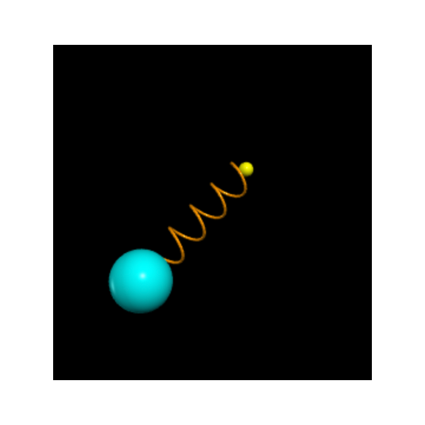
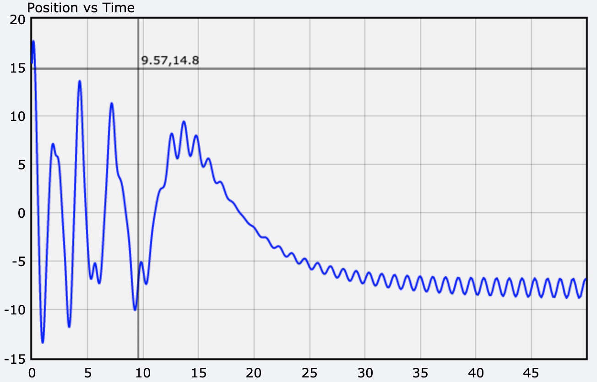
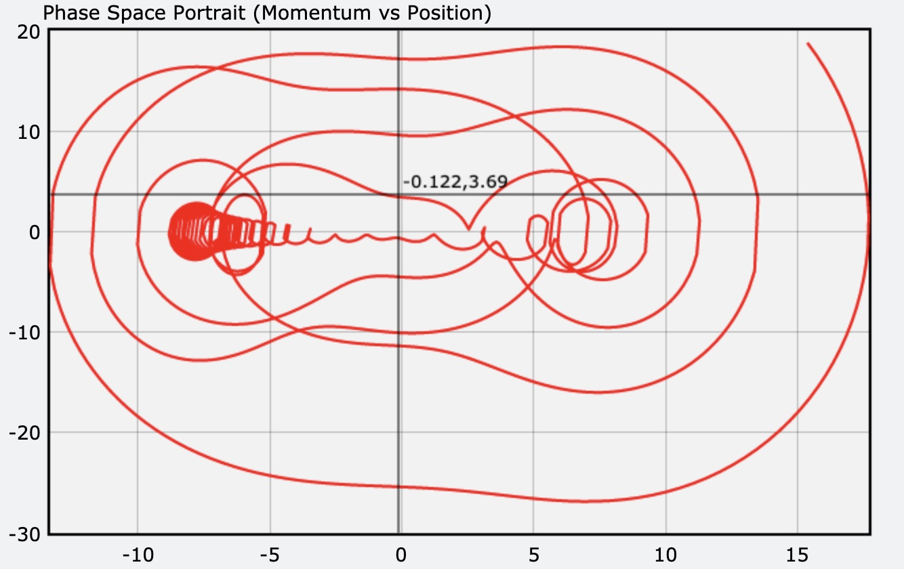

# Kinetic Energy
This project uses Glow - a Python based 3D rendering library to demonstrate the loss of kinetic and potential energy over time.

# Table of contents
1. [LiveDemo](#LiveDemo)
2. [Features](#Features)
3. [Technology](#Technology)
4. [Credits](#Credits)

## Live Demo
<a href="kinetic_energy.html">Click here to see live demo of kinetic and potential energy loss over time</a>

## Features
1. 3D rendering
2.  3d interactive scaling (using the mousewheel)
3.  animated graphs

## Technology
1. Javascript
2.  HTML
3.  Glow (A physics based 3d rendering engine for Python)

## Animated Graphs

## Credits
Bart Dority

**on github:** <a href='github.com/b0rgBart3'>b0rgBart3</a>

Email: bartdority@gmail.com

